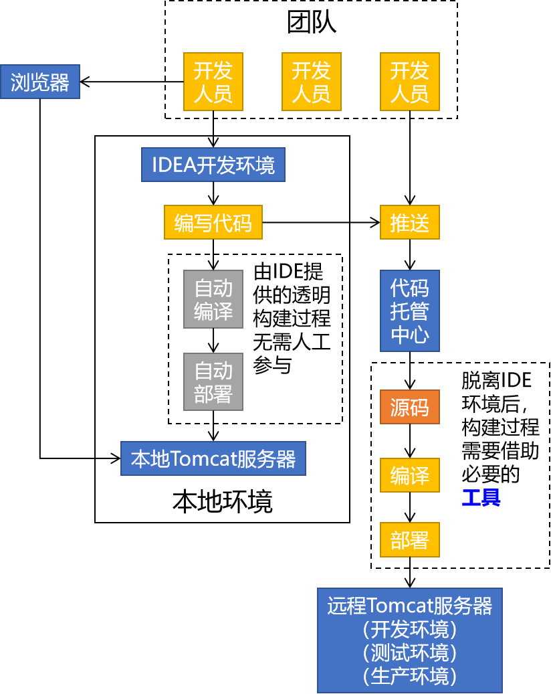

[TOC]

# 第一节 为什么要学习Maven？

## 1、从『构建』角度解释

### ①个人开发流程

### ②团队开发流程

> 引申：更大范围内的团队协作
>
> 

## 2、从『依赖』角度解释

### ①jar包的规模

随着我们使用越来越多的框架，或者框架封装程度越来越高，项目中使用的jar包也越来越多。项目中，一个模块里面用到上百个jar包是非常正常的。

### ②jar包的来源

- 这个jar包所属技术的官网。官网通常是英文界面，网站的结构又不尽相同，甚至找到下载链接还发现需要通过特殊的工具下载。

- 第三方网站提供下载。问题是不规范，在使用过程中会出现各种问题。

  - jar包的名称
  - jar包的版本
  - jar包内的具体细节

### ③jar包之间的依赖关系

框架中使用的jar包，不仅数量庞大，而且彼此之间存在错综复杂的依赖关系。依赖关系的复杂程度，已经上升到了完全不能靠人力手动解决的程度。另外，jar包之间有可能产生冲突。进一步增加了我们在jar包使用过程中的难度。

到目前为止，我们熟悉的jar包之间依赖关系有下面这些例子：

- junit-4.12依赖hamcrest-core-1.3
- thymeleaf-3.0.12.RELEASE依赖ognl-3.1.26
  - ognl-3.1.26依赖javassist-3.20.0-GA
- thymeleaf-3.0.12.RELEASE依赖attoparser-2.0.5.RELEASE
- thymeleaf-3.0.12.RELEASE依赖unbescape-1.1.6.RELEASE
- thymeleaf-3.0.12.RELEASE依赖slf4j-api-1.7.26

而实际上jar包之间的依赖关系是普遍存在的，如果要由程序员手动梳理无疑会增加极高的学习成本，而这些工作又对实现业务功能毫无帮助。

[回目录](index.html) [下一节](verse02.html)