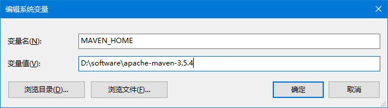

[TOC]

# 第二节 配置环境变量

## 1、检查JAVA_HOME配置是否正确

Maven是一个用Java语言开发的程序，它必须基于JDK来运行，需要通过JAVA_HOME来找到JDK的安装位置。


可以使用下面的命令验证：

```bash
C:\Users\Administrator>echo %JAVA_HOME%
D:\software\Java

C:\Users\Administrator>java -version
java version "1.8.0_141"
Java(TM) SE Runtime Environment (build 1.8.0_141-b15)
Java HotSpot(TM) 64-Bit Server VM (build 25.141-b15, mixed mode)
```


## 2、配置MAVEN_HOME



> 配置环境变量的规律：
>
> XXX_HOME指向的是bin目录的上一级
>
> PATH指向的是bin目录


## 3、配置PATH


## 4、验证

```bash
C:\Users\Administrator>mvn -v
Apache Maven 3.5.4 (1edded0938998edf8bf061f1ceb3cfdeccf443fe; 2018-06-18T02:33:14+08:00)
Maven home: D:\software\apache-maven-3.5.4\bin\..
Java version: 1.8.0_141, vendor: Oracle Corporation, runtime: D:\software\Java\jre
Default locale: zh_CN, platform encoding: GBK
OS name: "windows 10", version: "10.0", arch: "amd64", family: "windows"
```


[上一节](verse01.html) [回目录](index.html)