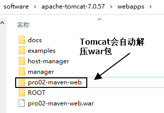

[TOC]

# 实验四：创建Maven版的Web工程

## 1、说明

使用mvn archetype:generate命令生成Web工程时，需要使用一个专门的archetype。这个专门生成Web工程骨架的archetype可以参照官网看到它的用法：


参数archetypeGroupId、archetypeArtifactId、archetypeVersion用来指定现在使用的maven-archetype-webapp的坐标。


## 2、操作

注意：如果在上一个工程的目录下执行mvn archetype:generate命令，那么Maven会报错：不能在一个非pom的工程下再创建其他工程。所以不要再刚才创建的工程里再创建新的工程，<span style="color:blue;font-weight:bold;">请回到工作空间根目录</span>来操作。

然后运行生成工程的命令：

```log
mvn archetype:generate -DarchetypeGroupId=org.apache.maven.archetypes -DarchetypeArtifactId=maven-archetype-webapp -DarchetypeVersion=1.4
```

下面的操作按照提示执行：

> Define value for property 'groupId': com.atguigu.maven
> Define value for property 'artifactId': pro02-maven-web
> Define value for property 'version' 1.0-SNAPSHOT: :【直接回车，使用默认值】
>
> Define value for property 'package' com.atguigu.maven: :【直接回车，使用默认值】
> Confirm properties configuration:
> groupId: com.atguigu.maven
> artifactId: pro02-maven-web
> version: 1.0-SNAPSHOT
> package: com.atguigu.maven
> Y: :【直接回车，表示确认】


## 3、生成的pom.xml

确认打包的方式是war包形式

```xml
<packaging>war</packaging>
```


## 4、生成的Web工程的目录结构


webapp目录下有index.jsp

WEB-INF目录下有web.xml


## 5、创建Servlet

### ①在main目录下创建java目录


### ②在java目录下创建Servlet类所在的包的目录


### ③在包下创建Servlet类

```java
package com.atguigu.maven;
	
import javax.servlet.http.HttpServlet;
import javax.servlet.http.HttpServletRequest;
import javax.servlet.http.HttpServletResponse;
import javax.servlet.ServletException;
import java.io.IOException;
	
public class HelloServlet extends HttpServlet{
	
	protected void doGet(HttpServletRequest request, HttpServletResponse response) throws ServletException, IOException {
		
		response.getWriter().write("hello maven web");
		
	}
	
}
```


### ④在web.xml中注册Servlet

```xml
  <servlet>
	<servlet-name>helloServlet</servlet-name>
	<servlet-class>com.atguigu.maven.HelloServlet</servlet-class>
  </servlet>
  <servlet-mapping>
	<servlet-name>helloServlet</servlet-name>
	<url-pattern>/helloServlet</url-pattern>
  </servlet-mapping>
```


## 6、在index.jsp页面编写超链接

```html
<html>
<body>
<h2>Hello World!</h2>
<a href="helloServlet">Access Servlet</a>
</body>
</html>
```

> JSP全称是Java Server Page，和Thymeleaf一样，是服务器端页面渲染技术。这里我们不必关心JSP语法细节，编写一个简单的超链接HTML标签即可。


## 7、编译

执行mvn compile命令出错：

> 程序包javax.servlet.http不存在
>
> 程序包javax.servlet不存在
>
> 找不到符号
>
> 符号: 类 HttpServlet
>
> ……

上面的错误信息说明：我们的Web工程用到了HttpServlet这个类，而HttpServlet这个类属于servlet-api.jar这个jar包。此时我们说，Web工程需要依赖servlet-api.jar包。


## 8、配置对servlet-api.jar包的依赖

对于不知道详细信息的依赖可以到https://mvnrepository.com/网站查询。使用关键词搜索，然后在搜索结果列表中选择适合的使用。


比如，我们找到的servlet-api的依赖信息：

```xml
<!-- https://mvnrepository.com/artifact/javax.servlet/javax.servlet-api -->
<dependency>
    <groupId>javax.servlet</groupId>
    <artifactId>javax.servlet-api</artifactId>
    <version>3.1.0</version>
    <scope>provided</scope>
</dependency>
```

这样就可以把上面的信息加入pom.xml。重新执行mvn compile命令。


## 9、将Web工程打包为war包

运行mvn package命令，生成war包的位置如下图所示：


## 10、将war包部署到Tomcat上运行

将war包复制到Tomcat/webapps目录下


启动Tomcat：




通过浏览器尝试访问：http://localhost:8080/pro02-maven-web/index.jsp


[上一节](verse03.html) [回目录](index.html) [下一节](verse05.html)