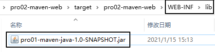

[TOC]

# 实验五：让Web工程依赖Java工程


## 1、观念

明确一个意识：从来只有Web工程依赖Java工程，没有反过来Java工程依赖Web工程。本质上来说，Web工程依赖的Java工程其实就是Web工程里导入的jar包。最终Java工程会变成jar包，放在Web工程的WEB-INF/lib目录下。


## 2、操作

在pro02-maven-web工程的pom.xml中，找到dependencies标签，在dependencies标签中做如下配置：

```xml
<!-- 配置对Java工程pro01-maven-java的依赖 -->
<!-- 具体的配置方式：在dependency标签内使用坐标实现依赖 -->
<dependency>
	<groupId>com.atguigu.maven</groupId>
	<artifactId>pro01-maven-java</artifactId>
	<version>1.0-SNAPSHOT</version>
</dependency>
```


## 3、在Web工程中，编写测试代码

### ①补充创建目录

pro02-maven-wb<span style="color:blue;font-weight:bold;">\src\test\java\com\atguigu\maven</span>


### ②确认Web工程依赖了junit

```xml
    <dependency>
      <groupId>junit</groupId>
      <artifactId>junit</artifactId>
      <version>4.12</version>
      <scope>test</scope>
    </dependency>
```


### ③创建测试类

把Java工程的CalculatorTest.java类复制到pro02-maven-wb<span style="color:blue;font-weight:bold;">\src\test\java\com\atguigu\maven</span>目录下


## 4、执行Maven命令

### ①测试命令

mvn test

说明：测试操作中会提前自动执行编译操作，测试成功就说明编译也是成功的。


### ②打包命令

mvn package


通过查看war包内的结构，我们看到被Web工程依赖的Java工程确实是会变成Web工程的WEB-INF/lib目录下的jar包。




### ③查看当前Web工程所依赖的jar包的列表

> mvn dependency:list
>
> [INFO] The following files have been resolved:
> [INFO]    org.hamcrest:hamcrest-core:jar:1.3:test
> [INFO]    javax.servlet:javax.servlet-api:jar:3.1.0:provided
> [INFO]    com.atguigu.maven:pro01-maven-java:jar:1.0-SNAPSHOT:compile
> [INFO]    junit:junit:jar:4.12:test

说明：javax.servlet:javax.servlet-api:jar:3.1.0:provided格式显示的是一个jar包的坐标信息。格式是：

> groupId:artifactId:打包方式:version:依赖的范围

这样的格式虽然和我们XML配置文件中坐标的格式不同，但是本质上还是坐标信息，大家需要能够认识这样的格式，将来从Maven命令的日志或错误信息中看到这样格式的信息，就能够识别出来这是坐标。进而根据坐标到Maven仓库找到对应的jar包，用这样的方式解决我们遇到的报错的情况。


### ④以树形结构查看当前Web工程的依赖信息

> mvn dependency:tree
>
> [INFO] com.atguigu.maven:pro02-maven-web:war:1.0-SNAPSHOT
> [INFO] +- junit:junit:jar:4.12:test
> [INFO] |  \- org.hamcrest:hamcrest-core:jar:1.3:test
> [INFO] +- javax.servlet:javax.servlet-api:jar:3.1.0:provided
> [INFO] \- com.atguigu.maven:pro01-maven-java:jar:1.0-SNAPSHOT:compile

我们在pom.xml中并没有依赖hamcrest-core，但是它却被加入了我们依赖的列表。原因是：junit依赖了hamcrest-core，然后基于依赖的传递性，hamcrest-core被传递到我们的工程了。


[上一节](verse04.html) [回目录](index.html) [下一节](verse06.html)