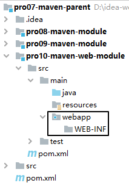
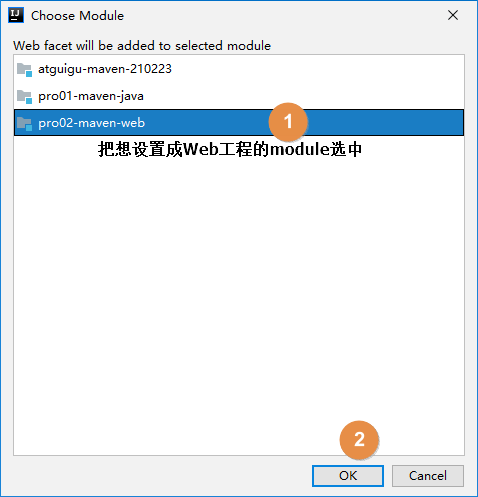
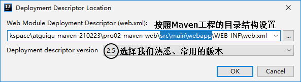

[TOC]

# 第四节 创建Web工程


## 1、创建模块

按照前面的同样操作创建模块，此时这个模块其实还是一个Java工程。


## 2、修改打包方式

```xml
<packaging>war</packaging>
```


## 3、增加目录




## 4、借助IDEA生成web.xml








[上一节](verse03.html) [回目录](index.html) [下一节](verse05.html)