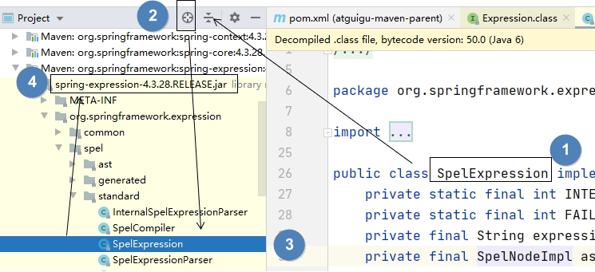

[TOC]

# 第四节 下载失败的第二种情况

## 1、文件校验工具

jar包表面上看起来是下载完的状态，结尾并没有“.lastUpdated”扩展名。但是程序运行时找不到这个jar包中的类。例如：针对jar包中的类出现ClassNotFoundException。

遇到类似问题需要先确认一下“有嫌疑”的jar包是否存在内部损坏问题。此时可以使用上面的文件校验工具。

## 2、用法

- 打开文件校验工具
- 将待校验的jar包拖拽到文件校验工具窗口内
- 将待校验的jar包旁边的*.sha1文件打开
- 比较两个SHA1值
- 一致：jar包完好
- 不一致：jar包损坏

## 3、原理

HASH加密包括很多具体加密算法，但是所有HASH算法都满足下面特征：

- 只要输入数据不变，任何时候执行加密，输出不变
- 输入数据有细微变化，输出数据跟着变化
- 不可逆，不能通过密文反推回明文
- 每一种具体的HASH加密算法加密后长度固定

## 4、找到有嫌疑的jar包

假设现在出现了一个ClassNotFoundException，提示找不到类：org.springframework.expression.Expression。此时我们怀疑这个类所在的jar包下载失败。 

- 窍门1：类所在的package命名往往和jar包坐标的groupId部分类似。
- 窍门2：在IDEA中按两下Shift键，使用全类名搜索

找到jar包后，点右键→Show in Explorer

- 窍门3：如果前面的办法都没法定位，只能根据这个类看上去的特征和可能的功能找有可能有关的jar包

## 5、为什么不建议删整个库

- 整个库删除后，需要重新下载整个库。此时东边的jar包没有失败，可能西边的jar包会失败。
- 整个库整体重新下载时，会有很多jar包并行下载的，相对来说并行下载本身就容易丢失数据。

[上一节](verse03.html) [回目录](index.html)